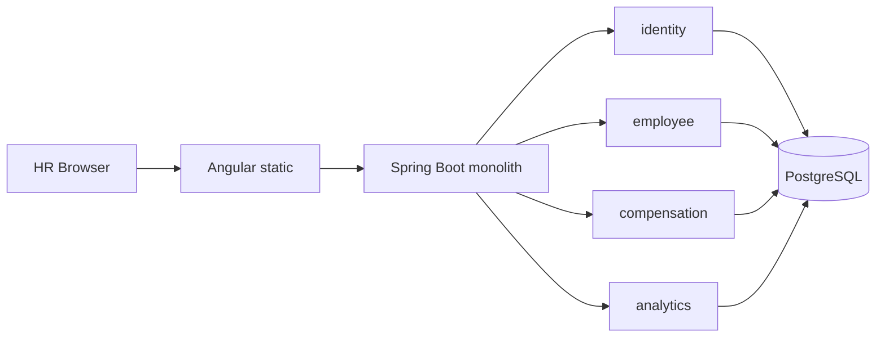

# PayLens Technical / Product Plan

**Status:** Review before implementation. No application source in this document.  
**Stack:** Java 21, Spring Boot 3.x, Angular (current, not AngularJS), PostgreSQL  
**Architecture:** Modular monolith, one deployable API + static UI  
**Related:** [requirements.md](./requirements.md), [assessment.md](./assessment.md)

---

## 1. Product interpretation

Assessment problem is **not** “build an HRIS.” It is: ACME HR keeps **10,000 salaries in Excel across countries**, and cannot easily **manage records** or **explain how the org pays people**.

PayLens is a **single-tenant compensation register**:

1. **System of record** for who works here and what their **current base pay** is.
2. **Question tool** for org-level pay patterns (by department, country, currency, status).
3. **History spine** so a raise is an event, not a cell overwrite. MVP stores succession of salary records; later work can add corrections, bands, and total rewards without a rewrite.

**Interpretation of “how the org pays people” (MVP):**

- Who is paid (headcount, active vs terminated).
- Where (country, department).
- In what money (currency split — first-class, never collapsed).
- How much **within one currency** (count, sum, average, median, simple bands).
- What changed recently (latest salary events).

Not in this interpretation: net pay, taxes, “total global payroll in one number,” or “are we fair vs market.”

**Assumptions (explicit):**

- One organization (ACME). No tenant_id.
- One human role: HR Manager. Seed one (or few) HR users.
- Base salary only. Frequency is `ANNUAL` or `MONTHLY` so numbers stay comparable *within* a currency after we normalize display to annual-equivalent **only inside the same currency**.
- Employees span several countries and at least 3–5 currencies in seed data.
- UI is **modern Angular** (assessment allows “AngularJS with Java”; we use current Angular — same family, maintainable).
- “Fully functional deployed” means Compose (API + UI + Postgres) on one host or a simple PaaS. Not Kubernetes.
- Assessment UI line also allows React; **user constraint wins: Angular**.

If any assumption is wrong, stop and correct before coding.

---

## 2. Primary user journey

**Happy path (HR Manager, Monday morning):**

1. Open PayLens → log in with HR credentials.
2. **Dashboard** answers: headcount; pay mix by country/department; compensation stats **per currency**; recent raises.
3. Need one person → **Employees** → type name / email / employee number (server search).
4. Optional filters: department, country, status, currency. Salary min/max **only after currency is chosen**.
5. Open **employee detail**: identity, current salary, history table.
6. **Change salary**: amount, currency, frequency, effective date, reason → previous current row closes → new current row opens.
7. **Add employee** (new hire) with first salary in one form.
8. **Terminate** (status + termination date); current salary remains historical fact, not deleted.

**Secondary journeys:**

- Correct a typo on name/email/department without creating a salary event.
- Filter “USD + Engineering + Active” to answer a director question.
- Scan recent salary changes on the dashboard instead of a spreadsheet changelog.

---

## 3. MVP scope

| Capability | Notes |
| --- | --- |
| Auth | Login / logout. Session for HR only. |
| Employee CRUD | Create, read, update. Soft end-of-employment via status, not hard delete in UI. |
| Directory | Server pagination + search + filters. |
| Current compensation | One current base salary per employee. |
| Salary change | Append-only succession (close previous, insert current). |
| Salary history | List on employee detail. |
| Reference data | Departments list; ISO country/currency codes. |
| Dashboard | SQL aggregates; currency-partitioned money metrics. |
| Seed | 10,000 employees + salaries + departments + HR user. |
| Deploy | Docker Compose: `postgres`, `api`, `web` (nginx → static + `/api` proxy). |
| Tests | Unit + API/slice tests on money and query rules. |
| Docs | This plan, one-page requirements, AI-usage log, short architecture note. |

**Modular monolith packages** (one Gradle/Maven module unless split becomes painful):

```
com.acme.paylens
  identity      // users, login
  employee      // employee aggregate, directory queries
  compensation  // salary records, succession rules
  analytics     // read models / query services
  seed          // command or profile to load 10k
  shared        // errors, paging, money types
```

API controllers may sit in those packages. **No** extra JARs, **no** service mesh.

---

## 4. Explicitly out of scope

- Payroll calculation, payslips, tax, social contributions, benefits, bonuses, allowances, equity, overtime.
- Market benchmarking, pay bands as policy engine, gender-pay-gap legal reports (can add later on same schema).
- Currency conversion, ECB/FX APIs, a single “total compensation” across currencies.
- Excel/CSV import or export (migration tooling later).
- Bulk edit, approvals, maker-checker, email/Slack.
- Employee or manager login; fine-grained RBAC; SSO/SAML.
- Multi-company, multi-tenant, cost-center accounting.
- Org chart builder, recruiting, attendance, performance reviews.
- Soft real-time, Kafka, Redis cache, Elasticsearch, Kubernetes, microservices.
- Hard-delete of employees from the product UI (keep data; optional admin later).
- Mobile native apps; offline Excel sync.
- Full SOC2 program (we still apply baseline security in §12).

---

## 5. Domain model

**Employee** — person in ACME. Identity + employment placement. Does **not** embed a mutable salary number.

**SalaryRecord (CompensationPeriod)** — a time-bounded base pay:

- `amount` + `currency` + `payFrequency`
- `[effectiveFrom, effectiveTo)` with `effectiveTo = null` meaning **current**
- `changeReason` (HIRE, RAISE, ADJUSTMENT, DEMOTION, CORRECTION, CURRENCY_CHANGE, OTHER)

Invariant: **at most one current** SalaryRecord per Employee.

**Department** — stable org bucket for filtering and grouping.

**HrUser** — who may use the app. Not an Employee in MVP (HR may or may not be in the 10k file).

**Money** — `(amount, currency)` pair. Domain forbids arithmetic between different currencies.

**EmploymentStatus** — `ACTIVE`, `ON_LEAVE`, `TERMINATED`.

**Annualization (display/analytics only, same currency):**

- `ANNUAL` → amount as-is  
- `MONTHLY` → amount × 12  

Never annualize across currencies. Store **as entered**; derive annual-equivalent in queries.

**Why history as rows, not overwrite:**

- Excel’s failure mode is lost raises.
- Future: “pay on 2025-06-01,” audit, bands over time.
- `effectiveTo` + partial unique index is enough; no event-sourcing framework.

```
Employee 1──* SalaryRecord
Department 1──* Employee
HrUser (standalone)
```

---

## 6. Proposed database entities

PostgreSQL, Flyway (or Liquibase) migrations. UUID PKs. `NUMERIC` for money. Optimistic lock `version` on `employee`.

### `department`

| Column | Type | Notes |
| --- | --- | --- |
| id | UUID PK | |
| code | VARCHAR(32) UNIQUE NOT NULL | e.g. ENG |
| name | VARCHAR(120) NOT NULL | |
| created_at | TIMESTAMPTZ NOT NULL | |

### `employee`

| Column | Type | Notes |
| --- | --- | --- |
| id | UUID PK | |
| employee_number | VARCHAR(32) UNIQUE NOT NULL | Human-stable ID |
| first_name | VARCHAR(100) NOT NULL | |
| last_name | VARCHAR(100) NOT NULL | |
| email | VARCHAR(255) UNIQUE NOT NULL | |
| country_code | CHAR(2) NOT NULL | ISO 3166-1 alpha-2 |
| department_id | UUID NOT NULL FK → department | |
| job_title | VARCHAR(120) NOT NULL | Free text in MVP |
| status | VARCHAR(20) NOT NULL | Check constraint |
| hire_date | DATE NOT NULL | |
| termination_date | DATE NULL | Required if TERMINATED |
| version | INT NOT NULL DEFAULT 0 | Optimistic lock |
| created_at / updated_at | TIMESTAMPTZ | |

Indexes: `(department_id)`, `(country_code)`, `(status)`, `(last_name, first_name)`, trigram or `ILIKE` support on name/email/number (pg_trgm if needed).

### `salary_record`

| Column | Type | Notes |
| --- | --- | --- |
| id | UUID PK | |
| employee_id | UUID NOT NULL FK → employee | ON DELETE RESTRICT |
| amount | NUMERIC(15,2) NOT NULL | `> 0` |
| currency_code | CHAR(3) NOT NULL | ISO 4217 |
| pay_frequency | VARCHAR(16) NOT NULL | ANNUAL / MONTHLY |
| effective_from | DATE NOT NULL | |
| effective_to | DATE NULL | NULL = current |
| change_reason | VARCHAR(32) NOT NULL | |
| note | VARCHAR(500) NULL | |
| created_at | TIMESTAMPTZ NOT NULL | |

Constraints:

- `amount > 0`
- `effective_to IS NULL OR effective_to >= effective_from`
- **Partial unique:** `UNIQUE (employee_id) WHERE effective_to IS NULL`
- Index `(employee_id, effective_from DESC)`
- Index for analytics: `(effective_to)` or partial `WHERE effective_to IS NULL` plus `(currency_code)`, join on employee department/country/status

### `hr_user`

| Column | Type | Notes |
| --- | --- | --- |
| id | UUID PK | |
| email | VARCHAR(255) UNIQUE NOT NULL | |
| password_hash | VARCHAR(100) NOT NULL | BCrypt |
| display_name | VARCHAR(120) NOT NULL | |
| enabled | BOOLEAN NOT NULL | |
| created_at | TIMESTAMPTZ | |

No Redis session store. Servlet session or signed cookie is enough for one instance.

### Seed shape (not extra product tables)

- ~8–12 departments
- Countries: e.g. US, GB, DE, IN, SG, AU, CA, NL (adjust in seed)
- Currencies aligned to country (USD, GBP, EUR, INR, SGD, AUD, CAD)
- ~10,000 employees, ~1.0–1.3 salary rows each (some with a prior raise so history is visible)

---

## 7. REST API boundaries

JSON, `/api/v1`, same origin behind nginx. Page queries: `page` (0-based), `size` (max 100, default 25), `sort`.

| Method | Path | Purpose |
| --- | --- | --- |
| POST | `/api/v1/auth/login` | Create session |
| POST | `/api/v1/auth/logout` | End session |
| GET | `/api/v1/auth/me` | Current HR user |
| GET | `/api/v1/employees` | Directory: `q`, `departmentId`, `countryCode`, `status`, `currencyCode`, `minAnnual`, `maxAnnual` |
| POST | `/api/v1/employees` | Create employee + first salary |
| GET | `/api/v1/employees/{id}` | Detail + current salary |
| PATCH | `/api/v1/employees/{id}` | Identity / employment fields (`If-Match` / version) |
| GET | `/api/v1/employees/{id}/salaries` | History, newest first |
| POST | `/api/v1/employees/{id}/salaries` | New current salary (closes previous) |
| GET | `/api/v1/departments` | Filter dropdowns |
| GET | `/api/v1/analytics/overview` | Headcount + recent changes |
| GET | `/api/v1/analytics/compensation-by-currency` | Money metrics, one row per currency |
| GET | `/api/v1/analytics/headcount-by-department` | Non-money |
| GET | `/api/v1/analytics/headcount-by-country` | Non-money |
| GET | `/api/v1/analytics/salary-bands` | Requires `currencyCode` |

**Rules:**

- `minAnnual` / `maxAnnual` rejected unless `currencyCode` present.
- Analytics money endpoints always key by `currencyCode` (and frequency-normalized annual amount in that currency).
- 401 unauthenticated; 403 unused in MVP (single role); 404 unknown employee; 409 version or “already current salary conflict”; 422 validation.
- No public employee PII. No “get all 10k” endpoint.

**Not an API in MVP:** reports download, admin user management UI, batch salary update.

---

## 8. Frontend screens

Angular standalone components, Angular Material (or CDK + simple CSS if Material is heavy — prefer Material for tables/forms). Routed app, auth guard.

| Screen | Route | Job |
| --- | --- | --- |
| Login | `/login` | Email + password |
| Dashboard | `/` | Org pay questions |
| Employee list | `/employees` | Search, filters, paginator |
| Employee create | `/employees/new` | Identity + first salary |
| Employee detail | `/employees/:id` | Profile, current pay, history, actions |
| Salary change | `/employees/:id` dialog or `/employees/:id/salary` | New SalaryRecord |
| Not found / session expired | simple | |

**List UX:** do not bind 10k rows. Table = current page only. Filters in query params so refresh/share works.

**Detail UX:** current salary highlighted; history read-only. Edit profile vs change salary are separate actions (avoid accidental overwrite).

**No** settings, user admin, or dark-theme project for MVP unless Material default is free.

---

## 9. Dashboard analytics

All aggregates in SQL (or JPA `@Query` / JDBC). API does not load 10k entities to average in Java.

**Non-money (safe to combine globally):**

- Total employees; by `status`
- Headcount by department
- Headcount by country

**Money (partition by `currency_code`):**

For **current** salaries of **ACTIVE** employees (ON_LEAVE included or separate toggle — default: ACTIVE + ON_LEAVE as “employed”):

- Employee count
- Sum of **annual-equivalent**
- Average annual-equivalent
- Median annual-equivalent (`percentile_cont(0.5)`)
- Simple bands (e.g. five buckets computed in SQL from min/max or fixed breakpoints **per currency** — fixed breakpoints must be currency-specific or use quantile bins so INR and USD are not the same cut lines)

**Recent activity:** last N salary_record inserts (employee name, currency, amount, reason, date).

**UI rule:** each currency is its own card/table. No “grand total pay.” Optional footnote: “Amounts not comparable across currencies.”

**Employed vs terminated:** default analytics = employed. Terminated available later via query param; keep MVP default honest.

---

## 10. Validation rules

**Employee**

- `employee_number`, `email` unique (DB + API).
- Email format; names 1–100 chars; job title required.
- `country_code` in allowed ISO set used by seed/API.
- `department_id` must exist.
- `hire_date` not after `termination_date`.
- `TERMINATED` ⇒ `termination_date` required; `ACTIVE`/`ON_LEAVE` ⇒ `termination_date` null.
- Cannot create employee without a first salary.

**Salary**

- `amount` > 0, max 2 decimal places, `NUMERIC(15,2)` ceiling.
- `currency_code` ISO 4217 from allowed list.
- `pay_frequency` enum only.
- `effective_from` required.
- New current: if previous exists, `effective_from` ≥ previous `effective_from`. Close previous with `effective_to = new.effective_from` (same-day succession allowed: old ends the day new starts; document as half-open interval).
- Reject second concurrent current (unique index + 409).
- Changing currency is allowed (reason `CURRENCY_CHANGE`); still no FX.

**Directory**

- `size` 1–100.
- Salary range requires currency.

**Auth**

- Unknown user / bad password → same generic 401.
- Password policy only for create (seed + future); login just verifies hash.

---

## 11. Important edge cases

- Two employees, same name — search by number/email.
- Rehire: MVP = new employee_number (no employment-period entity). Document; do not fake a rehire graph.
- Terminate then still listed — filter status; salary history intact.
- Raise with `effective_from` before previous `effective_from` — reject (no silent rewrite). Corrections = later product (or `CORRECTION` only if we add an explicit admin path; **MVP reject backdated overlap**).
- First salary on hire_date; later raise same day — allowed (close + open).
- Monthly vs annual in one currency on dashboard — always compare annual-equivalent.
- Zero or negative salary — reject.
- Pagination past last page — empty content, correct `totalElements`.
- Concurrent HR tabs: stale `version` on employee PATCH → 409; salary unique index → 409.
- Inactive/disabled HR user — cannot login.
- Empty department after filters — empty table, not error.
- Seed rerun — idempotent or “run once” (`INSERT` if empty). Prefer **seed only when employee count = 0** to avoid dupes.

---

## 12. Security considerations

Salary is highly sensitive. MVP is still a real app, not an open admin panel.

- All `/api/v1/**` except login require authenticated HR session.
- Passwords: BCrypt. No plaintext in repo (seed password in README / `.env.example` only).
- Session: HTTP-only, `Secure` in prod, `SameSite=Lax`. Prefer **server session** over JWT in `localStorage`.
- CSRF: enabled if cookie session; Angular reads CSRF cookie/header. If we use bearer JWT in memory only, CSRF is less relevant — **pick one and stick**. Recommendation: **cookie session + CSRF** behind same-origin nginx.
- SQL: bind parameters only (Spring Data / named params).
- XSS: Angular interpolation; no `innerHTML` for employee fields.
- Headers: Spring Security defaults (cache, frame, content-type).
- Do not log salary amounts, emails, or tokens at INFO.
- CORS locked to the web origin if API and UI split in dev; prod same origin.
- Demo deploy: change default password via env. No anonymous analytics.
- Authorization: every employee row is visible to HR (single tenant). No row-level security needed yet.
- File upload: none (reduces attack surface).

Assessment is not a penetration test; these are the bar for “production-quality” at this size.

---

## 13. Performance considerations (10,000 employees)

10k rows is **small** for PostgreSQL. Risk is **loading everything into the browser or the JVM**, not the database engine.

**Do:**

- Directory: SQL `LIMIT/OFFSET` or keyset; total count via `COUNT(*)` with same predicates (10k count is cheap).
- Indexes on filter/join columns (§6).
- Analytics: `GROUP BY` on current-salary subset (`effective_to IS NULL`).
- Seed: batched inserts (`saveAll` chunks of 500–1000 or `COPY`/`JdbcTemplate` batch). One-shot seed at startup if empty.
- Avoid N+1: directory query **join current salary** in one query (DTO projection), not `Employee` + lazy `salaries`.
- Connection pool: Hikari default is fine for one instance.
- Angular: OnPush where easy; no virtual scroll required if page size ≤ 50.

**Do not:**

- Redis for this read volume.
- Elasticsearch for name search (pg `ILIKE` + indexes; `pg_trgm` if needed).
- Client-side filter of 10k JSON.
- Microservice split “for scale.”

**Target:** list p95 < 200ms locally; dashboard < 300ms. If missed, explain with EXPLAIN — do not add cache first.

---

## 14. Testing strategy

**Principles:** fast, deterministic, no live internet. Test behavior that can be wrong (money, succession, filters), not framework wiring.

**Backend unit (no DB):**

- Annualization.
- Validation predicates (terminated needs date; range needs currency).
- Succession date rules (pure functions if extracted).

**Backend integration (Testcontainers PostgreSQL or `@SpringBootTest` + test Postgres):**

- Create employee + first salary → one current row.
- Second salary closes first; unique current holds.
- Reject overlapping / backdated succession.
- Directory pagination totals and `q` match.
- Salary range without currency → 422.
- Analytics: two currencies → two groups; **no** combined sum in payload.
- Auth: unauthenticated directory → 401.

**Frontend:**

- Login form validation.
- Employee filter: salary inputs disabled until currency set.
- Dashboard renders per-currency cards from fixture (no mixed total).

**Skip in MVP:** huge Cypress suite, visual regression, load test of 1M rows.

**CI:** `./mvnw test` + `ng test --no-watch --browsers=ChromeHeadless` (or project equivalents).

---

## 15. Deployment architecture

```
[Browser]
    │
    ▼
[nginx]  static Angular
    │    /api/*  →  Spring Boot :8080
    ▼
[Spring Boot 3 / Java 21]   modular monolith
    │
    ▼
[PostgreSQL 16]
```

**Compose services:** `db`, `api`, `web`. Volumes for Postgres. Env: `DATABASE_URL`, `JWT_OR_SESSION_SECRET`, `SEED_HR_PASSWORD`.

**Process:** Flyway on API startup → optional seed if empty → serve.

**Hosting:** one VM or Compose on a laptop for demo; optional single-region PaaS (Railway/Render/Fly) **without** k8s. HTTPS at the edge if public.

**Ops (minimal):** health `GET /actuator/health` (info locked down); no Prometheus mesh required.

**Demo video (assessment):** record login → dashboard → search → salary change → history. Not a code task in this plan.

---

## 16. Risks and trade-offs

| Decision | Benefit | Cost / risk |
| --- | --- | --- |
| Modular monolith | Matches scale; simple deploy; readable for assessors | Must keep package boundaries honest |
| Salary rows + `effective_to` | History without event sourcing | Need careful close-the-old transaction |
| No FX | Cannot lie about global totals | Dashboard has no single “payroll” number — product must teach this |
| No Excel import | Less scope, fewer bugs | ACME cannot bulk-migrate a real sheet in MVP |
| Cookie session | Safer than JWT in localStorage | CSRF + proxy cookie path must be correct |
| OFFSET pagination | Simple, good enough at 10k | Deep pages slightly slower; fine here |
| Free-text job title | Fast seed and UI | Weak grouping by title |
| Testcontainers | Real SQL (partial unique index) | Slightly slower CI; worth it |
| Material + Angular | Fast, consistent tables | Bundle size; acceptable |
| Seed-on-empty | Idempotent enough | Changing seed logic later won’t refresh existing DB |

**Biggest product risk:** building payroll or “platform” features to look senior. Assessment rewards **judgment**, not Kafka.

**Biggest correctness risk:** averaging or summing USD + INR on the dashboard.

**Biggest delivery risk:** auth/CSRF/proxy wasting time. Spike login + nginx early.

---

## 17. Suggested incremental implementation order

Each step should be a **reviewable Git commit** (or a tight pair of commits). Do not implement until this plan is accepted.

| Step | Commit theme | Verify |
| --- | --- | --- |
| 1 | Docs: requirements + this plan + AI-usage log start | Files exist; scope freeze |
| 2 | Repo skeleton: Gradle API, Angular workspace, Compose, README | `compose` builds empty services |
| 3 | Flyway schema + entities + repositories | Migration applies on empty DB |
| 4 | Compensation domain: create / succeed salary | Unit + DB tests green |
| 5 | Employee API: CRUD + paged directory | curl/http tests; no full-table GET |
| 6 | Analytics SQL + API | Two-currency fixture; no mixed sum |
| 7 | Identity: login, session, lock down APIs | 401 without cookie |
| 8 | Seed 10k | Count = 10000; seed ~seconds, not minutes |
| 9 | Angular shell, login, auth interceptor | Login works vs API |
| 10 | Employee list + filters + pagination | Query params; page changes |
| 11 | Create + detail + salary change | History shows two rows after raise |
| 12 | Dashboard | Per-currency cards; headcount charts |
| 13 | Harden: validation messages, 409, security headers | Tests for edge cases |
| 14 | Compose polish, sample env, health, short demo script | Fresh `compose up` + seed usable |
| 15 | AI-usage and trade-off notes updated from real work | Artifacts match what we did |

**Do not skip:** currency-safe analytics test before building a pretty chart.

---

## Intentional AI usage (how we will use it)

- **Now:** architecture and scope (this file). Human owns trade-offs.
- **Later:** generate boilerplate (entities, Angular table) then **human-review** money rules and tests.
- **Never:** accept dashboard code that sums across currencies; never add infra “because the model suggested it.”
- **Log:** [ai-usage.md](./ai-usage.md) — prompt intent, what we kept, what we rejected.

---

## Architecture (logical)



Same process, package modules, one database.

---

## Open points (need confirmation only if you disagree)

1. Cookie session + CSRF vs JWT — plan assumes **cookie session**.
2. Employed = ACTIVE + ON_LEAVE on dashboard.
3. Same-day raise allowed; backdated overlap rejected.
4. No CSV import in MVP.
5. Modern Angular, not AngularJS.

Approve or amend these five; then implementation can start at step 2 (skeleton) after committing docs if you ask for commits.
